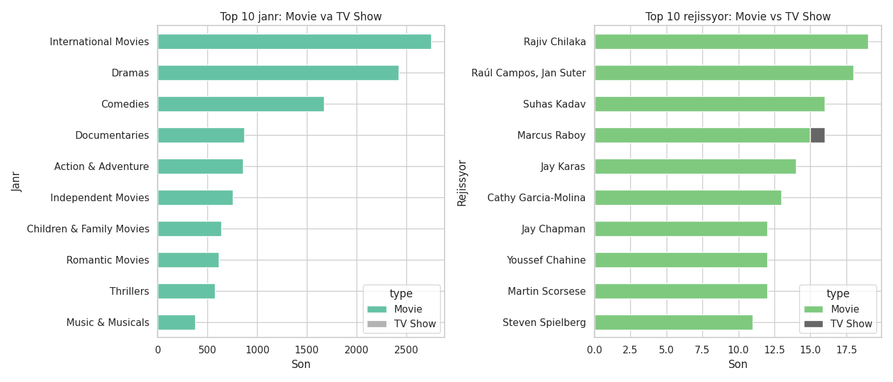

# 📊 Netflix Shows EDA Project

This project is an Exploratory Data Analysis (EDA) of Netflix Movies and TV Shows.  
The dataset was taken from Kaggle and analyzed using Python in Google Colab.

## 📁 Dataset Info

- Source: Kaggle – Netflix Movies and TV Shows
- Columns included: `title`, `type`, `director`, `cast`, `country`, `date_added`, `rating`, `duration`, `genre`, etc.

## 🧑‍💻 Tools Used

- Python (Pandas, Matplotlib, Seaborn)
- Google Colab
- GitHub

## 📌 Key Steps

1. Null values handling
2. Data cleaning and transformation
3. Feature extraction (main country, main genre, year added, etc.)
4. Visualizations and trend analysis

## 📈 Key Insights

- **Top genres** were visualized, comparing Movies vs TV Shows.
- **Top directors** with the most content on Netflix were analyzed.
- **Content trends** were examined over years.
- Country-based content distribution was explored.

## 📊 Example Visualizations



## 🗂 Folder Structure
```bash
Netflix-EDA/
├── Netflix_Data_Analysis.ipynb
├── README.md
└── images/
    └── combined_graphs.png
```

## 🔚 Conclusion

This project provided hands-on experience with:
- Real-world data cleaning
- Exploratory data analysis
- Creating visual storytelling using data

## 🔗 Author

**Javohir Valijonov**  
[GitHub Profile](https://github.com/Valijonoff)  
[LinkedIn](https://linkedin.com/in/javohir-valijonov)
